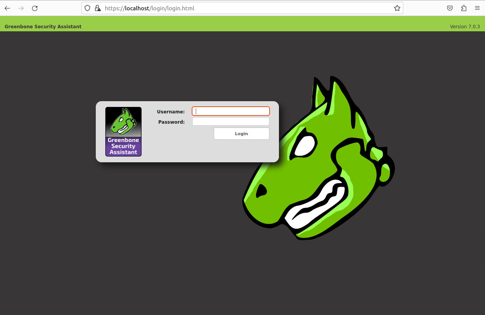
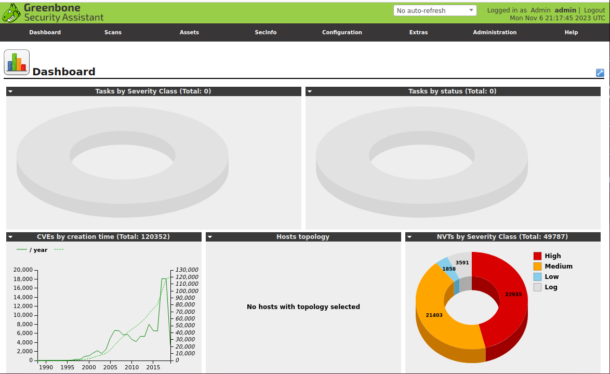

# Project 1 - "OpenVAS in Docker"

### System Administration Fall 2023

### Zack Mattie

## OpenVAS Installation in Docker Container

### Part 1
- This installation document begins with the assumption that Docker has been installed with Docker Compose. These are essential for completing this project.

- The first step for this project is to clone the repository that is available to the public. That is done with the command `sudo docker pull mikesplain/openvas`. 

- IMPORTANT: This does take a while!

- Now you can run the docker. I use `docker run -d -p 443:443 --name openvas mikesplain/openvas`

- Now that the docker is running, I open up Firefox or any other web browser and go to `https://localhost` which resolves to a GUI for Greenbone Security Assistant.

- The GUI includes a username box and password box. The default is used which is `admin` and `admin`. Below is a screenshot of this GUI.

- 

- Next we need to install GNOME by using `sudo apt install gnome-core`. 

- After this, all required steps are complete with installing OpenVAS. I have to make sure the container is running and I can use the OpenVAS system server to do a vulnerability scan.

- There are many different ways of doing this so this instruction manual is how I did it on my machine. 

- 